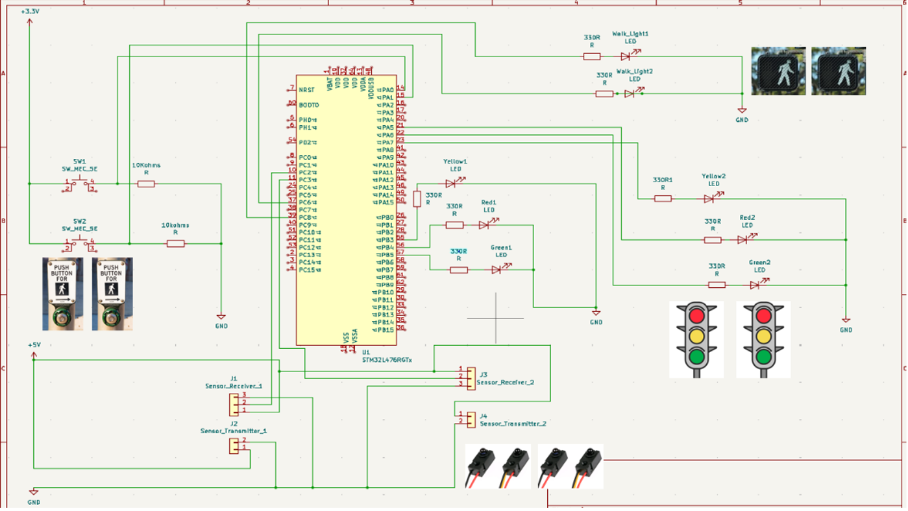
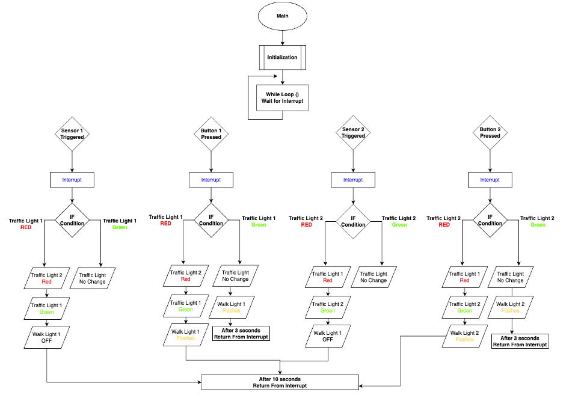

# **SFSU ENGR 478 — Final Project**

## **Traffic Light System**

### **Group: C-Note**
- Bryan Thorne (Lead Design Engineer) 
- Steven Ta (Design Engineer) 
- Kevin Thai (Project Manager, Design Engineer) 

### **Acknowledgements**
Project completed with guidance from:  
- **Dr. Xiaorong Zhang**  
- **Prof. George Anwar**  

---

# **stm32-traffic-light**  
Embedded traffic light controller built on an STM32 Nucleo-L476RG board. Includes dual traffic signals, pedestrian walk lights, IR sensors, and button inputs. Implements a finite-state machine, SysTick timing, and real-world intersection behavior.

---

## **Introduction**  
The goal of this project was to create a traffic light system using the STM32L476RG board. We made two different traffic lights that were used to simulate an intersection of two one-way roads. To make the system more realistic, we added a pedestrian walk light. We used IR break beam sensors to detect vehicles and push buttons to simulate pedestrians.  

The software integrates interrupts for sensor and button input, and uses the SysTick timer to handle state timing. Our motivation came from seeing intersections throughout San Francisco and wanting to understand how embedded systems can replicate real traffic behavior.

---

## 🎥 Demo Video

## **Components**  
- 2 IR break beam sensors  
- 2 Push buttons  
- Wiring  
- 8 LEDs  
  - 2 Red  
  - 2 Green  
  - 2 Yellow  
  - 2 Clear  
- 2 × 10 kΩ resistors (for buttons)  
- 8 × 330 Ω resistors (for LEDs)

---

## Hardware Layout

  
  

---

## Wiring Schematic

---

## Flowchart

---

